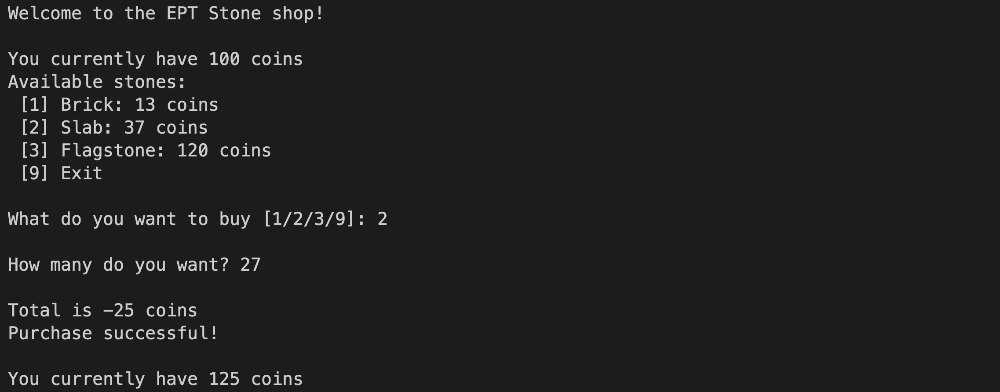
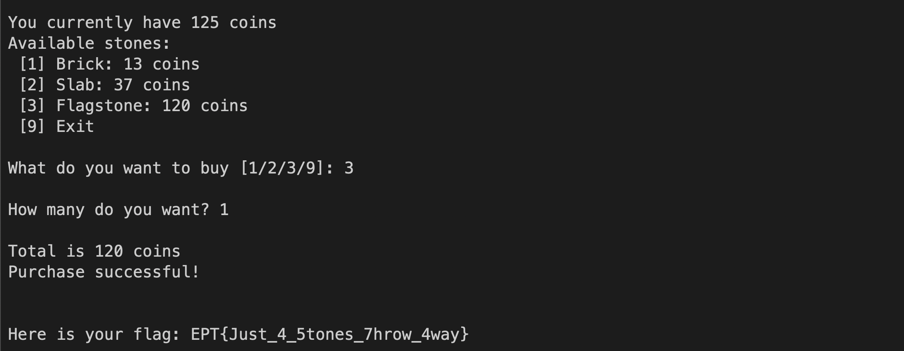

# Stoneshop Write - Team B00S

`Author: Bludsoe`


## Initial thoughts

We have been given a program `Stoneshop` that lets us buy different kinds of stones; brick, slab or flagstone. We start with 100 coins, and the brick and slab cost 13 and 37 coins respectively, while the flagstone cost 120 coins. There is no way to earn coins, so we have to find a way to make it possible to buy the flagstone, even though we don't actually have 120 coins. 

## Understanding the code

```C
int __fastcall main(int argc, const char **argv, const char **envp)
{
  int v4; // [rsp+8h] [rbp-8h] BYREF
  char v5; // [rsp+Ch] [rbp-4h]
  char v6; // [rsp+Dh] [rbp-3h]
  char v7; // [rsp+Eh] [rbp-2h]
  char i; // [rsp+Fh] [rbp-1h]

  ignore_me_init_buffering(argc, argv, envp);
  puts("Welcome to the EPT Stone shop!");
  for ( i = 100; ; i -= v5 )
  {
    while ( 1 )
    {
      while ( 1 )
      {
        while ( 1 )
        {
          while ( 1 )
          {
            printf("\nYou currently have %d coins\n", i);
            v7 = menu();
            if ( v7 == -1 )
            {
              puts("\nSee you later!");
              return 0;
            }
            if ( v7 != -2 )
              break;
            puts("\nNot a valid option, please choose again!");
          }
          if ( v7 <= i )
            break;
          puts("\n Sorry, you can't afford any of those...");
        }
        printf("\nHow many do you want? ");
        __isoc99_scanf("%d", &v4);
        v6 = v4;
        if ( (char)v4 > 0 )
          break;
        puts("\nMust buy at least 1...");
      }
      v5 = v7 * v6;
      printf("\nTotal is %d coins\n", (char)(v7 * amount));
      if ( v5 <= i )
        break;
      puts("That's too expensive!");
    }
    puts("Purchase successful!");
    if ( v7 == 120 )
      break;
  }
  print_flag();
  return 0;
}
```

By decompiling the file we were given, we can read the pseudocode for the program. Here we have 2 crucial parts:

`1. The variables:`
```C
int v4; // [rsp+8h] [rbp-8h] BYREF - amount_input
char v5; // [rsp+Ch] [rbp-4h] - price
char v6; // [rsp+Dh] [rbp-3h] - amount
char v7; // [rsp+Eh] [rbp-2h] - stonetype_price
char i; // [rsp+Fh] [rbp-1h] - coins
```

Since the variables are signed chars and that they're also 8-bits (1 byte each which we can see from the offsets), we know that their range is from -128 to 127. If these variables are not handled correctly, we can take advantage of it and change it's value to something we want.

`2. Total price calculation:`
```C
v5 = v7 * v6;
printf("\nTotal is %d coins\n", (char)(v7 * amount));
if ( v5 <= i )
    break;
puts("That's too expensive!");
```

This calculation in addition to the fact that the variables are signed 8-bit chars, is what causes the vulnerability. 


## The Exploit

If we pick the stonetype (v7) to be slab, this will cost 37 coins. If we then choose to buy 27 of these slabs, the calculation of the price (considering this is a signed 8-bit char) will be as follows:

```
37 * 27 mod 256 = 231
231 > 128 => create negative
231 - 256 = -25
```

To explain this calculation a bit further, we basically want to buy an amount n of either slabs or bricks, such that the `price*x = Z`, such that `-20 <= Z <= -27`, because the new coin price will then be `100 -= Z` which will then be anywhere between 120-127. This can be done in many ways, but we are restricted to a positive amount:

```
Remember everything here operates in mod 256. So we take price * n (mod 256), and if we have a value greater than 128, we do the "new value" - 256 to get it to a negative integer within the range -128 to 127.

Bricks (Price: 13):
n = 18 -> result = -22
n = 57 -> result = -27
n = 77 -> result = 23

Slabs (Price: 37):
n = 27 -> result = -25
n = 34 -> result = -22
n = 110 -> result = 26
n = 117 -> result = -23
n = 124 -> result = -20
```

Now we can simply choose any of these to be able to get an amount between 120-127. For this example, we choose to buy slabs, and an amount of 27 which gives us a result of -25, and then a new coin amount of 125 which is enough for the flagstone.



Now that we have 125 coins, we have enough to buy the flagstone.



The flag for this task is: `EPT{Just_4_5tones_7hrow_4way}`